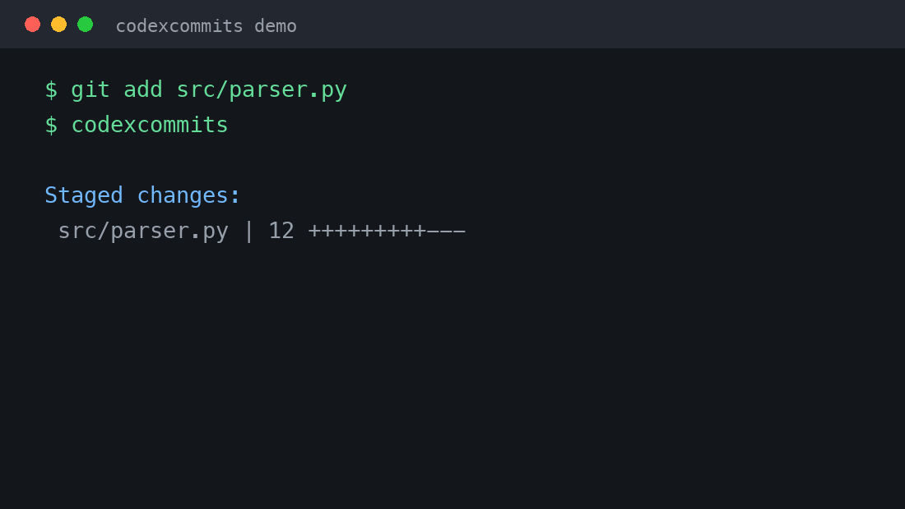

# codexcommits

[](https://github.com/COKEiiii/codexcommits/actions/workflows/ci.yml)
[](https://github.com/COKEiiii/codexcommits/releases/latest)
[](LICENSE)

The beginner-friendly commit command for people who already use Codex.

Stage your changes, run one command, and review the generated Conventional
Commit before Git creates it. There are no API keys, provider settings, prompt
files, or language runtimes to configure.

```console
$ git add src/parser.py
$ codexcommits
Staged changes:
 src/parser.py | 12 +++++++++---

feat(parser): handle nested markdown tables

[y] commit  [e] edit  [r] regenerate  [n/Enter] cancel:
```

[简体中文](README.zh-CN.md)

**AI-generated Conventional Commits using your existing Codex login. No API
keys. No provider setup.**



**Install on macOS, Linux, or WSL2:**

```bash
brew install COKEiiii/tap/codexcommits
```

## What you need

- Git
- the [Codex CLI](https://developers.openai.com/codex/cli/) on `PATH`
- an existing ChatGPT login in Codex: `codex login status`

`codexcommits` is a single executable. It does not require Python, Node.js, an
OpenAI API key, or a separate model account.

## Install

### macOS, Linux, and WSL2

```bash
brew install COKEiiii/tap/codexcommits
```

Upgrade later with:

```bash
brew upgrade codexcommits
```

### Windows PowerShell

```powershell
irm https://raw.githubusercontent.com/COKEiiii/codexcommits/main/install.ps1 | iex
```

This installs the latest Windows executable in your user profile and adds it
to your user `PATH`. You can inspect [install.ps1](install.ps1) before running
it. Manual downloads for macOS, Linux, and Windows are also available on the
[Releases page](https://github.com/COKEiiii/codexcommits/releases/latest).

## Use it

```bash
git add path/to/file
codexcommits
```

`git diff --cached` is optional. It is useful when you want to inspect the
staged diff yourself; `codexcommits` reads the staged snapshot automatically.

At the prompt:

| Key | Action |
|---|---|
| `y` | create the commit with the displayed message |
| `e` | replace the complete message, then review it again |
| `r` | ask Codex for another suggestion; this uses more allowance |
| `n`, Enter, or Ctrl-C | cancel and preserve the staged changes |

Generate a message without committing:

```bash
codexcommits --print
```

By default, the tool uses the model selected by your Codex CLI with low
reasoning. Most users do not need to change anything. Run
`codexcommits --help` to see the optional advanced flags.

Choose a model from a numbered menu for one run:

```bash
codexcommits --choose-model
```

Choose and save a default model from the same menu:

```bash
codexcommits --set-model
```

Later, regular `codexcommits` runs use that saved choice. Restore Codex CLI's
default model at any time:

```bash
codexcommits --reset-model
```

Advanced users can still pass a model directly with `--model MODEL` or `-m MODEL`.
The selected value is passed to Codex CLI as-is.

## What happens behind the command

1. The tool checks that you are inside a Git repository with staged changes.
2. It captures the exact staged Git tree and sends only its textual diff to
   Codex.
3. Codex returns one schema-validated Conventional Commit subject.
4. The tool shows the suggestion and waits for your choice.
5. If you accept, it verifies that HEAD and the staged tree are unchanged and
   runs a normal `git commit`.

The tool never runs `git add` or `git push`. Normal Git hooks, signing, and
configuration still apply.

## Privacy and Codex usage

The staged textual diff is sent through Codex to OpenAI under the policies of
the ChatGPT account already used by Codex. Do not stage secrets. Binary contents
are not included in Git's textual diff, and diffs larger than 100 KB are rejected
before Codex runs.

Each generation uses Codex allowance. Choosing `r` makes another request.
`codexcommits` removes API-key environment variables from the Codex child
process and verifies that the active login reports ChatGPT. It does not read or
store your credentials.

## Feedback

Found a bug or have an idea that would help Codex beginners? Please open an
[issue](https://github.com/COKEiiii/codexcommits/issues/new/choose) with your
OS, architecture, `codexcommits --version`, and `codex --version`. Remove
secrets and private source code before posting.

## Similar projects

The general idea already exists. This project focuses on a small, predictable
workflow for Codex beginners: explicit staging, ChatGPT authentication, staged
snapshot checks, review before commit, and no provider configuration. See
[MARKET_RESEARCH.md](MARKET_RESEARCH.md) for the comparison.

## Development

```bash
go test ./...
go vet ./...
go build .
```

Tests use temporary Git repositories and a mocked generation boundary, so CI
does not need Codex credentials.

The README demo can be regenerated with Pillow:

```bash
python3 -m pip install Pillow
python3 scripts/make-demo-gif.py
```

## License

MIT
